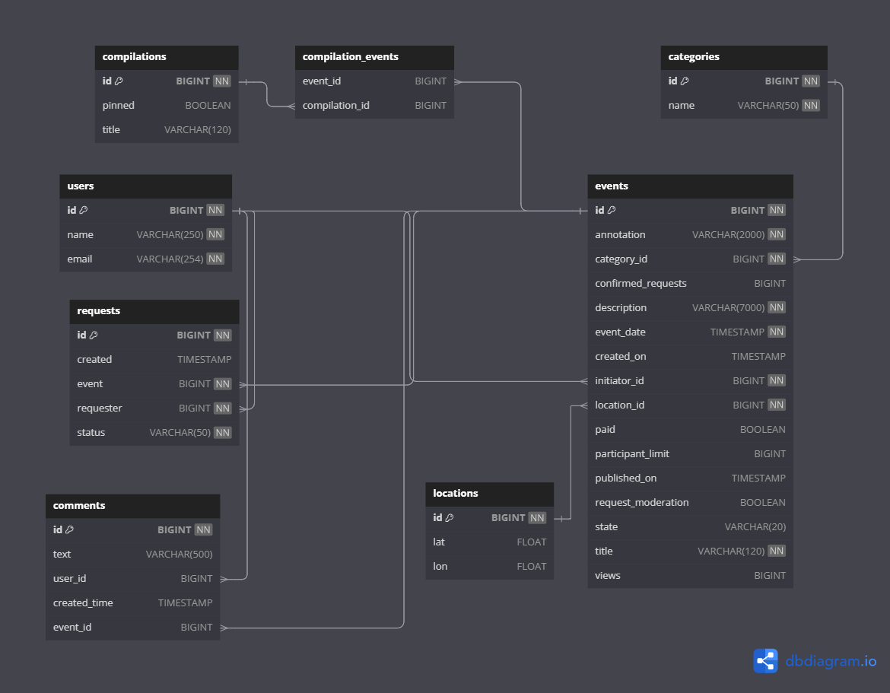

# Java Explore With Me
## Бэкенд приложения, которое позволяет пользователям делиться информацией об интересных событиях и находить компанию для участия в них.
### Разработанное приложение — афиша. В этой афише можно предложить какое-либо событие от выставки до похода в кино и собрать компанию для участия в нём. Приожение сотсоит из 2 модулей :
* Основной сервис. Содержит всё необходимое для работы продукта. API основного сервиса состоит из трех частей:
  1. Публичная доступна без регистрации любому пользователю сети.
  2. Закрытая доступна только авторизованным пользователям;
  3. Административная — для администраторов сервиса.
* Сервис статистики. Собирает информацию о количестве обращений пользователей к спискам событий и о количестве запросов к подробной информации о событии. На основе этой информации формируется статистика о работе
  приложения.
## Реализованный функционал:
1. Публичная часть:
  - Получение подборок событий
  - Получение подборки событий по id
  - Получение категории
  - Получение информации о категории по id
  - Получение событий с возможностью фильтрации
  - Получение информации о событии по id
  - Публикация комментария
  - Обновление комментария пользователем
  - Удаление комментария пользователем
  - Получение комментария пользователем по id
2. Административная часть:
  - Добавление новой категории
  - Удаление категории
  - Изменение категории
  - Поиск события
  - Редактирование данных о событии и его статуса (отклонение/публикация)
  - Получение информации о пользователях
  - Добавление нового пользователя
  - Удаление пользователя
  - Добавление новой подборки
  - Удаление подборки
  - Обновление информации о подборке
  - Получение комментария по id
  - Полученеи комментариев события по id события
  - Удаление комментария
  - Обновление комментария
3. Закрытая часть:
  - Получение событий, добавленных текущим пользователем
  - Добавление нового пользователя
  - Получение полной информации о событии, добавленном текущим пользователем
  - Изменение события, добавленном текущим пользователем
  - Получение информации о запросах на участие в событии текущего пользователя
  - Изменение статуса(подтверждение/отклонение) заявок на на участие в событии текущего пользователя
  - Получение информации о заявках текущего пользователя на участие в чужих событиях
  - Добавление заявки от текущего пользователя на участие в событиях
  - Отмена своего запроса на участие в событии
## ER-диаграмма

## Требования для запуска:
* JDK 11
* Git
* Maven
* Docker
## Запуск проекта:
* Скачивание проекта
```
git clone https://github.com/Dmitriy-Dyachihin/java-explore-with-me.git
```
* Сборка проекта
```
cd java-explore-with-me
mvn clean package
```
* Запуск проекта в Docker
```
docker-compose up
```
## Стек технологий:
* Java
* Rest API
* Docker
* Apache Maven
* PostgreSQL
* H2Database
* Hibernate
* Spring Boot
* Lombok
* Mapstruct
* JPA
* Postman
## Тестирование:
Postman-тесты для приложения [ссылка](https://github.com/Dmitriy-Dyachihin/java-explore-with-me/tree/main/postman)